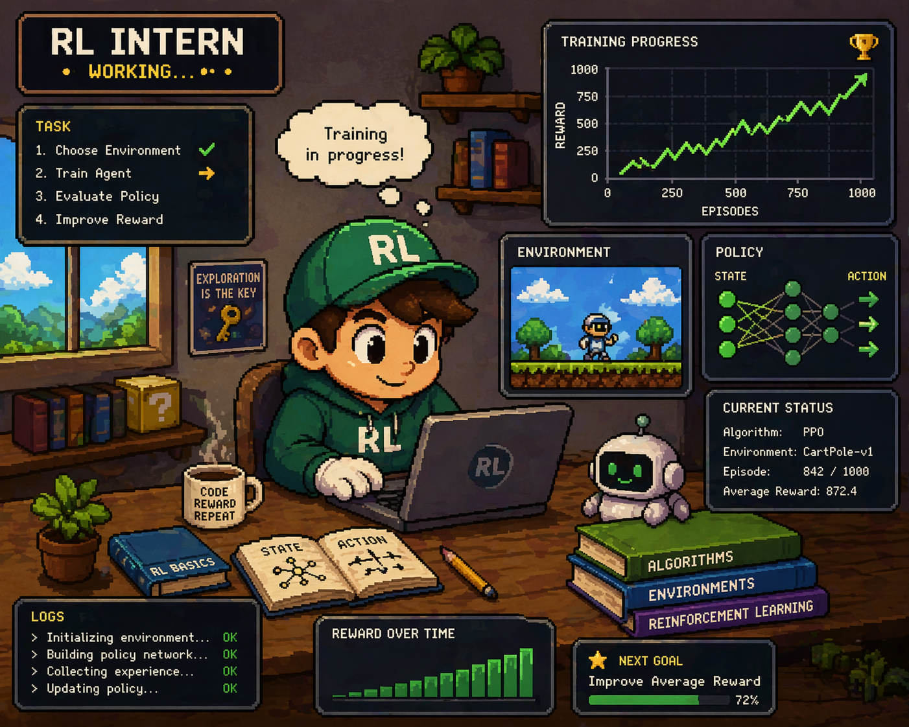
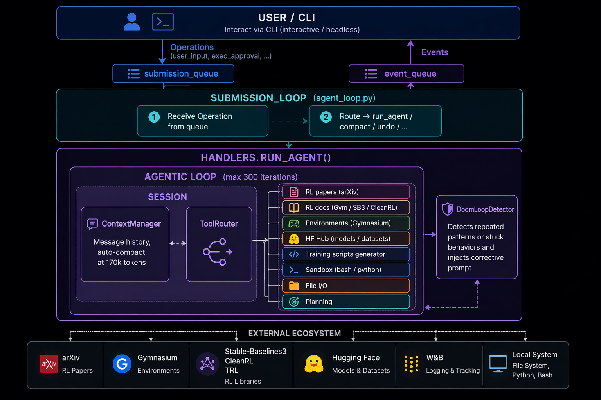

<div align="center">



# 🤖 RL Intern

**Your autonomous Reinforcement Learning engineer.**  
Reads papers. Builds agents. Ships models. All while you sleep.

[](https://www.python.org/)
[](https://www.anthropic.com)
[](https://huggingface.co)
[](LICENSE)
[](https://stable-baselines3.readthedocs.io)
[](https://modelcontextprotocol.io)
[](https://github.com/astral-sh/uv)

<br/>

> *"Give it a task. Walk away. Come back to a trained model on the Hub."*

</div>

---

## ✨ What is RL Intern?

RL Intern is an **autonomous AI agent** that acts as your personal RL engineer. Give it a natural language task and it will:

- 📄 **Research** — search arXiv, read papers, understand SOTA algorithms  
- 🌍 **Explore** — inspect Gymnasium environments, understand state/action spaces  
- 🛠️ **Implement** — generate complete training scripts (PPO, DQN, SAC, TD3)  
- 🏋️ **Train** — run experiments in a sandboxed subprocess with live logs  
- 📊 **Evaluate** — report mean reward, std deviation, episode stats  
- 🚀 **Ship** — upload trained models directly to the Hugging Face Hub  

It's inspired by [ml-intern](https://github.com/huggingface/ml-intern) — but purpose-built for **Reinforcement Learning**.

---

## 🏗️ Architecture

<div align="center">

</div>

<br/>

The agent runs an **async agentic loop** with two queues:

| Queue | Direction | Purpose |
|---|---|---|
| `submission_queue` | CLI → Agent | User input, approvals, undo, compact |
| `event_queue` | Agent → CLI | Streaming text, tool calls, results, errors |

The loop routes every operation through **Session** → **ToolRouter** → **15 built-in RL tools** (+ any MCP servers you configure), while a **DoomLoopDetector** automatically breaks stuck repetitive patterns.

---

## ⚡ Quick Start

### 1. Clone & install

```bash
git clone https://github.com/enfibiotech/rl-intern-.git
cd rl-intern-
uv sync
uv tool install -e .
```

> **Requires:** Python 3.11+, [uv](https://github.com/astral-sh/uv)

### 2. Set your API keys

```bash
cp .env.example .env
```

```env
# Required
ANTHROPIC_API_KEY=sk-ant-...

# Required for HuggingFace uploads
HF_TOKEN=hf_...

# Optional
GITHUB_TOKEN=ghp_...
WANDB_API_KEY=...
```

### 3. Run it

```bash
rl-intern
```

That's it. You're now talking to your RL engineer. 🎉

---

## 🚀 Usage

### Interactive mode (REPL)

```bash
rl-intern
```

```
> train a PPO agent on CartPole-v1 for 500k steps and upload to HuggingFace
> search for recent offline RL papers on arXiv
> what MuJoCo environments are best for SAC?
> evaluate my model at ./models/best_model on LunarLander-v2
```

### Headless / one-shot mode

```bash
rl-intern "train DQN on LunarLander-v2 and report the mean reward"
```

### CLI flags

| Flag | Default | Description |
|---|---|---|
| `--model` | `claude-sonnet-4-20250514` | Any LiteLLM model string |
| `--max-iterations` | `300` | Agentic loop iteration cap |
| `--no-stream` | off | Disable token streaming |
| `--auto-approve` | off | Skip approval gates (use carefully) |
| `--config` | `configs/main_agent_config.json` | Custom config path |

```bash
rl-intern --model anthropic/claude-opus-4-6 --max-iterations 150 "your prompt"
rl-intern --auto-approve "run a quick CartPole benchmark"
```

### Slash commands (interactive mode)

| Command | Action |
|---|---|
| `/help` | Show all commands |
| `/compact` | Manually compact the context window |
| `/undo` | Undo the last message |
| `/quit` | Exit |

---

## 🧰 Built-in Tools (15)

| Tool | Description |
|---|---|
| `search_rl_papers` | Search arXiv for RL papers by query |
| `read_rl_paper` | Fetch full abstract + metadata for an arXiv ID |
| `list_rl_environments` | List Gymnasium envs with optional filter |
| `inspect_environment` | Show obs/action space and spec for any env |
| `search_rl_docs` | Search docs for Gymnasium, SB3, CleanRL, TRL, RLlib |
| `generate_training_script` | Generate complete SB3 training script (PPO/DQN/SAC/TD3) |
| `run_bash` | Execute shell commands in sandbox *(approval required)* |
| `run_python` | Execute Python code in sandbox *(approval required)* |
| `read_file` | Read any file with optional line limit |
| `write_file` | Write file to disk *(approval required)* |
| `search_hf_rl_models` | Search HF Hub for trained RL models |
| `upload_model_to_hf` | Upload a model folder to HF Hub *(approval required)* |
| `install_package` | `pip install` any package *(approval required)* |
| `evaluate_model` | Run N evaluation episodes and report reward stats |
| `create_plan` | Output a numbered plan before complex tasks |

---

## 🔌 MCP Server Support

RL Intern supports the **Model Context Protocol** — connect any MCP server to extend capabilities with external tools.

Edit `configs/main_agent_config.json`:

```json
{
  "mcpServers": {
    "filesystem": {
      "transport": "stdio",
      "command": "npx -y @modelcontextprotocol/server-filesystem /tmp/workspace",
      "args": []
    },
    "github": {
      "transport": "stdio",
      "command": "npx -y @modelcontextprotocol/server-github",
      "env": { "GITHUB_PERSONAL_ACCESS_TOKEN": "${GITHUB_TOKEN}" }
    },
    "wandb": {
      "transport": "http",
      "url": "https://mcp.wandb.ai/sse",
      "headers": { "Authorization": "Bearer ${WANDB_API_KEY}" }
    }
  }
}
```

MCP tools appear automatically, prefixed with their server name:

```
> use filesystem__read_file to check my training logs
> search github for PPO implementations
```

**Supported transports:** `stdio` (local subprocess) · `http` / `sse` (remote server)

---

## 🧩 Adding Custom Tools

Drop a `ToolSpec` into `agent/core/tools.py` or pass it at runtime:

```python
from agent.core.tools import ToolSpec
from agent.core.session import Session

async def my_handler(env_id: str) -> str:
    return f"Custom result for {env_id}"

my_tool = ToolSpec(
    name="my_rl_tool",
    description="Does something custom with a Gymnasium env",
    parameters={
        "type": "object",
        "properties": {
            "env_id": {"type": "string", "description": "Gymnasium env ID"}
        },
        "required": ["env_id"]
    },
    handler=my_handler,
    requires_approval=False,
)

session = Session(
    model_name="anthropic/claude-sonnet-4-20250514",
    extra_tools=[my_tool],
)
```

---

## 🐍 Programmatic Usage

Use RL Intern as a Python library — no CLI needed:

```python
import asyncio
from agent.core.session import Session
from agent.core.agent_loop import AgentLoop
from agent.core.events import EventType

async def run(task: str):
    session = Session(model_name="anthropic/claude-sonnet-4-20250514")
    agent = AgentLoop(session, max_iterations=50)
    asyncio.create_task(agent.run())

    await agent.event_queue.get()          # READY
    await agent.send_user_input(task)

    while True:
        event = await agent.event_queue.get()
        if event.type == EventType.ASSISTANT_CHUNK:
            print(event.data["text"], end="", flush=True)
        elif event.type == EventType.TURN_COMPLETE:
            break

asyncio.run(run("List the top 5 Gymnasium environments for PPO"))
```

See [`examples/programmatic_usage.py`](examples/programmatic_usage.py) for the full version.

---

## 🐳 Docker

```bash
docker build -t rl-intern .
docker run -it \
  -e ANTHROPIC_API_KEY=$ANTHROPIC_API_KEY \
  -e HF_TOKEN=$HF_TOKEN \
  -v $(pwd)/workspace:/workspace \
  rl-intern
```

---

## 🗂️ Project Structure

```
rl-intern/
├── agent/
│   ├── cli.py                   ← Rich terminal UI, REPL + headless mode
│   └── core/
│       ├── agent_loop.py        ← Agentic loop (submission_queue / event_queue)
│       ├── session.py           ← Wires ContextManager + ToolRouter + MCPClient
│       ├── tool_router.py       ← Routes to built-ins OR MCP servers
│       ├── tools.py             ← 15 RL-specific built-in tools
│       ├── mcp_client.py        ← MCP: stdio + HTTP/SSE transports
│       ├── context_manager.py   ← Message history + auto-compaction at 170k tokens
│       ├── doom_loop.py         ← Detects & breaks repetitive tool patterns
│       └── events.py            ← Typed event bus
├── configs/
│   └── main_agent_config.json   ← Model, limits, MCP servers
├── tests/
│   ├── test_core.py             ← Tools, context, doom loop tests
│   └── test_mcp.py              ← MCP client + routing tests
├── examples/
│   ├── programmatic_usage.py    ← Use as a Python library
│   └── custom_tool.py           ← Add your own tools
├── src/
│   ├── architecture.png
│   └── info.png
├── pyproject.toml
├── Dockerfile
└── .env.example
```

---

## 🧪 Running Tests

```bash
uv run pytest tests/ -v
```

---

## 🤝 Contributing

Contributions are welcome! To add a new built-in tool:

1. Add an `async def handle_*` function in `agent/core/tools.py`
2. Add a `ToolSpec` entry in `create_builtin_tools()`
3. Add tests in `tests/test_core.py`
4. Open a PR 🎉

---

## 🙏 Acknowledgements

Built on the shoulders of giants:

- [ml-intern](https://github.com/huggingface/ml-intern) — the architecture inspiration
- [Anthropic Claude](https://www.anthropic.com) — the brain
- [Stable-Baselines3](https://stable-baselines3.readthedocs.io) — RL algorithms
- [Gymnasium](https://gymnasium.farama.org) — environments
- [Hugging Face Hub](https://huggingface.co) — model hosting
- [LiteLLM](https://litellm.ai) — unified LLM interface
- [Model Context Protocol](https://modelcontextprotocol.io) — tool extensibility

---

<div align="center">

**Made with ❤️ for the RL community**

⭐ Star this repo if RL Intern saved you time!

</div>
